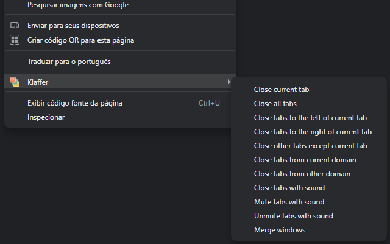

# Klaffer
Google Chrome extension for manage tabs.

<p align="center">
  
</p>

# Features
* Close current tab
* Close all tabs
* Close tabs to the left of current tab
* Close tabs to the right of current tab
* Close other tabs except current tab
* Close tabs from current domain
* Close tabs from other domain
* Close tabs with sound
* Mute tabs with sound
* Unmute tabs with sound
* Merge windows

# Running
### 1. Run
```
# Open Google Chrome extensions
At the top right, turn on Developer mode

# Load
Click Load unpacked

# Select
Find and select the Klaffer folder
```

### 2. Build
```
# Find the Klaffer folder
Zip the folder. Then, Publish it in the Chrome Web Store.
```

# Authors
* [xxgicoxx](https://github.com/xxgicoxx)

# Acknowledgments
* [FlatIcon](https://www.flaticon.com/)